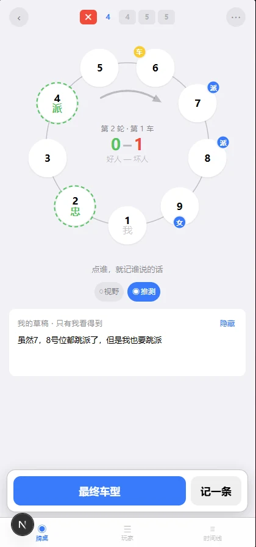
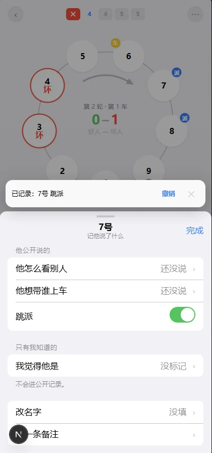
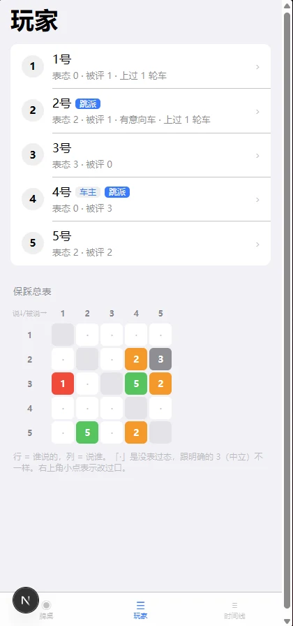
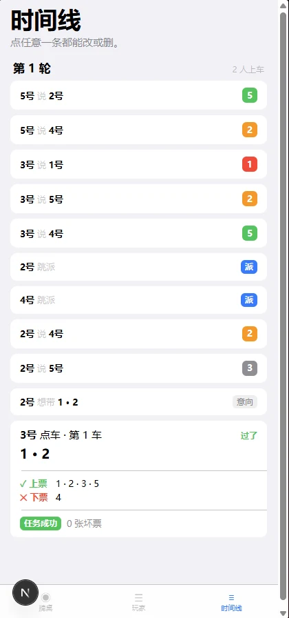

<p align="center">
  
</p>

<h1 align="center">Avalor · 阿瓦隆记录本 + AI 参谋</h1>

<p align="center">
  牌桌怎么坐，屏幕就怎么画 —— 然后让一个真读得懂这局的 AI，替你把牌理一遍。
</p>

<p align="center">
  
  
  
  
  
  
</p>

<p align="center">
  <b>简体中文</b> · <a href="README.en.md">English</a>
</p>

---

## 这是什么

一局 9–10 人的阿瓦隆要打 45–90 分钟。人脑很难同时记住：谁保过谁、谁踩过谁、态度什么时候变的、每辆车谁发的、谁上了什么票、哪些任务崩了。记不住，就只能凭感觉打。

Avalor 分两层解决这件事：

> **下层，把牌桌记成结构化数据 —— 不打断游戏节奏，两次点击记完一件事。**
> **上层，一键把这份数据交给 AI —— 逐个座位给判断，或者替你把这轮发言排好。**

**这两层是同一件事的两面。** 对着任何一个聊天机器人复述「9 人局第 4 轮，我觉得 3 号有问题」，它只能陪你聊天 —— 它手上什么都没有。Avalor 的 AI 拿到的是每一辆车、每一张座位级的票、意向车和真发车的差异、每一次改口。**记得越细，它说得越准；记录不是目的，是燃料。**

先看下层怎么记 ——

<table>
<tr>
<td width="25%"></td>
<td width="25%"></td>
<td width="25%"></td>
<td width="25%"></td>
</tr>
<tr>
<td valign="top"><b>圆桌就是操作界面</b><br><sub>按真实座次坐，车／派／女角标把局势画在座位上。推测层只有你看得见。</sub></td>
<td valign="top"><b>点谁，就记谁说的话</b><br><sub>保踩、意向车、跳派分开存，两次点击记完，公开与私有当场分栏。</sub></td>
<td valign="top"><b>全场态度，一张表看完</b><br><sub>行是谁说的、列是说谁。「·」是没表过态，跟明确的 3 不是一回事。</sub></td>
<td valign="top"><b>一局就是一条改不坏的时间线</b><br><sub>发车、座位级票型、保踩顺次排开，点任意一条都能改或删。</sub></td>
</tr>
</table>

下面逐条展开。

### 1. 圆桌就是操作界面，不用在脑子里做一次翻译

你固定在圆桌最下方（6 点钟），其他人按真实座次排开。**牌桌上没人想「3 号」，想的是「我左手第二个」** —— 圆桌直接映射到你脑中已有的那张图。同一块圆桌按模式承担四种操作：

| 你在干什么 | 点圆桌意味着 |
|---|---|
| 平时 | 选一个人，记他说了什么 |
| 记保踩 | 选他在说谁，然后打 1–5 分 |
| 发车 / 意向车 | 选谁上车 |
| 记票型 | 每点一下切换 上票 / 下票 / 不清楚 / 没记 |

它同时也是局势显示：车主有「车」角标、跳派的人有「派」角标、车上的人高亮，**票型的空间分布一眼可见** —— 上票的人是不是坐一块儿，这是竖排列表根本给不了的信息。

### 2. 把「谁说了什么」拆成结构，而不是一坨流水账

每个人身上挂三类公开表达：

- **保踩** —— 他对别人的 1–5 态度，两次点击记完，不用按保存
- **意向车** —— 他嘴上说会带谁，**与他真发的车分开存**，所以「说带 1/3/5、真带 2/4/6」一眼可见
- **跳派** —— 有没有跳派西维尔

这些表态在玩家页汇成一张**保踩总表**：行是谁说的、列是说谁。谁被集火、谁全程不表态、谁跟谁互保，不用翻时间线就看得出来；改过口的格子还会带一个角标。

加上牌局本身的**动作**：发车、座位级完整票型、任务结果与坏票数；外加一个自由文本备注兜底。打完还有刺杀与复盘 —— 记下刺了谁、每个人的真实身份。到这一步，一局记录就是**能一条条回看的完整战报**：谁从第几轮开始演、哪句话事后看是真信息、那张关键下票到底是谁投的，翻记录就有答案。

### 3. 私有信息独立成层，只有你看得见

还有一层**只有你看得见的信息**：你这局的身份、身份给你的视野、你对每个人的推测。视野和推测是两个独立开关，**默认都隐藏**，每次进页面重置 —— 你低头记东西时，旁边人扫一眼什么也看不到。

这一层在数据结构上也是独立的：私有事件单独标记、不进时间线、可以整层摘掉。所以**把一局记录分享给牌友复盘时，你的身份和推测不会跟着一起走** —— 导出的公开版本里，只有牌桌上人人都听见、都看见的东西。

### 4. 事件溯源 + 本地优先，残缺数据也永远合法

一局游戏 = 一串不可变事件，界面上每个状态都由**纯函数**从事件日志推导出来。改口不覆盖历史、票型不做反推、只记住一半的票照记不误。全部数据存在浏览器本地（IndexedDB），没有账号也没有后端，**记录本身断网可用** —— 只有你主动点 AI 按钮时才会联网。

---

## AI 参谋：一键读局，一键组织发言

圆桌下面有两个按钮。

**「分析局势」** —— 逐个座位给判断、一句落到具体车和票上的依据、以及它自己的把握程度（把握大 / 一般 / 只是猜），最后几条关键结论。**它按你的身份分岔**：给梅林分析「谁是坏人」毫无意义 —— 他早就看见了，他真正要问的是「我暴露了没有」。

| 你的身份 | 它主要回答 |
|---|---|
| 梅林 | 谁是派西维尔、哪个是刺客，以及**你暴露了没有** |
| 派西维尔 | 你看到的那两个人里，哪个才是梅林 |
| 忠臣 | 谁是坏人，谁最像梅林（认出来别说破） |
| 坏人方 | 梅林在哪、派西维尔是谁、队友暴露了多少 |
| 刺客 | 以上，外加「现在这一刀该刺谁」 |

**「帮我发言」** —— 给大纲，不给讲稿。4–6 条按顺序排好的要点、一句总基调，外加最要命的那一栏：**这轮千万别说的话**。可以塞一句「我想锤 4 号」定方向，满意就存进草稿。

两个功能吃的是同一份输入：`briefing.ts` 这个纯函数把事件日志渲染成的中文简报，该分开的绝不合并 —— 没表过态 vs 明确中立、意向车 vs 真发的车、女神当众说的 vs 你实际看到的、改口的整条链。提示词里写死了模型最容易搞错的规则，并要求它信息不够就说不好说。

### 这是唯一会把数据发出去的地方

说清楚代价：这两个按钮会把**这一局的记录**发到模型服务商，其中**包含你的身份、视野和推测** —— 不发这些，它没法帮梅林找刺客。所以：

- 第一次点的时候会拦一下，把要发的东西列清楚，你同意才发
- 结果页可以随时展开**看到发出去的原文**，一个字不差
- 不点就一个字节都不发；不配 API key 时整个功能不存在，App 其余部分照常离线可用
- 结果从不写回你的记录 —— 除非你自己点「存进草稿」

---

## 怎么开一局

打开是封面，点一下进菜单。开局只要三步：**几人局 → 点你自己 → 点第一个车主**。角色配置按人数给出官方牌型，在开局时确认。

---

## 几条不肯妥协的数据语义

这些是整个数据结构的地基，也是测试覆盖的重点：

1. **空白 ≠ 中立。** 没表过态和明确说「看不清」（3）是两回事，绝不把空白自动填成 3。
2. **改口不覆盖历史。** 3 号对 6 号从 4 改到 5 再改到 2，三条都在，时间线里看得到完整变化。
3. **票型不能只存票数。** 6-4 通过，不同的 6 个人含义完全不同，所以存座位级完整票型；「记为不清楚」和「根本没记」也是两种状态。
4. **通过与否以你记的为准，绝不从票型反推。** 记了一半的票反推出来的结论，会错得很自信。
5. **残缺数据永远合法。** 只记住一半的票、没数清的坏票，照记不误。
6. **排序只认 `sequence`，不认时间戳。** 设备时钟会跳，按时间戳排会悄悄搞乱一整局。
7. **私有信息必须可整层剥离。** 身份、视野、推测单独成层，导出公开版本时一次性摘干净，绝不掺进公开事件流。

---

## 架构

```
src/lib/
  types/       事件与派生类型（三类事件：动作 / 表态 / 私有）
  rules/       官方人数表、第 4 轮双坏票规则、各角色视野
  selectors/   全部推导逻辑（纯函数，可单测）
    derive-timeline.ts   ← 核心 fold：阶段、当前车、轮次编号、车主
    private.ts           ← 私有层，与公开层严格隔离
  events/      事件增删改与级联规则
  store/       Zustand（乐观更新）+ Dexie 串行写入队列
  db/          IndexedDB（唯一允许 import dexie 的地方）
  stats/       个人胜率统计
  fixtures/    测试夹具构造器
  ai/          可选的 AI 层，与上面完全解耦
    briefing.ts          ← 纯函数：事件日志 → 给模型读的中文局势简报
    prompts.ts           ← 提示词，按身份分岔
    parse.ts             ← 宽容解析模型输出
src/app/api/ai/route.ts  ← 唯一持有 API key 的地方（服务端）
```

两个值得一提的判断：

- **阶段是推导出来的，不是维护出来的。** `deriveTimeline` 一次 O(n) 折叠产出全部结构状态，阶段按声明式不变式算出（「有没投票的车 ⟺ voting」）。一个预扫描先定好每辆车的权威投票，所以折叠过程永远不需要撤销已施加的效果 —— 重记一次票因此是安全操作。
- **车主锚定在最后一个已知事实上，不用取模计数。** 用户手动改一次车主，计数器就永久错位且无法自愈。号码方向和车主轮换方向是两个独立设置，因为牌桌可以这么编号、那么传车。
- **AI 的输入是一个纯函数的输出。** `buildBriefing` 把事件日志渲染成中文简报，在浏览器里跑 —— 服务端路由只负责拿着 key 转发，从不碰事件日志。这既让提示词的输入可以单测（那些「没表过态 ≠ 中立」的区分有专门的测试守着），也让「给我看发出去的是什么」能拿出一模一样的字节。

---

## 开发

```bash
npm install
npm run dev                  # http://localhost:3000
npm run dev -- -H 0.0.0.0    # 手机同 WiFi 访问
npm test                     # 227 项单元测试
npm run build
```

要用 AI 功能的话，多一步：

```bash
cp .env.example .env.local   # 然后填上 OPENAI_API_KEY
```

`.env.local` 在 `.gitignore` 里，key 只有服务端路由读得到，**永远不会进浏览器的 bundle**。换模型改 `AI_MODEL` 一行即可；`AI_BASE_URL` 可以指向任何 OpenAI 兼容的服务。不配的话 App 照常跑，只有那两个按钮会提示没配置。

部署见 [DEPLOY.md](./DEPLOY.md)。

---

## 数据隐私

记录全部存在浏览器本地（IndexedDB），没有账号，整个后端只有 `/api/ai` 这一个路由 —— 它存在的唯一理由是替你保管 API key。**除了你主动点 AI 按钮的那一刻，数据不会离开设备。**

- 记录、查看、导出、复盘：全程离线，一个请求都不发
- 点「分析局势」或「帮我发言」：把**这一局**的记录（含你的身份、视野、推测）发一份快照给模型服务商。首次会明确询问，之后可随时在结果页查看发出去的原文
- 其他对局的记录永远不会被带上

代价是浏览器可能清理长期未访问站点的数据 —— 所以建议把页面**添加到主屏幕**（已安装的 PWA 不受影响），并在打完一局后导出 JSON 备份。

日后如果加入账号和云端同步，数据就会离开设备，届时会在注册流程里明确说明同步什么。
